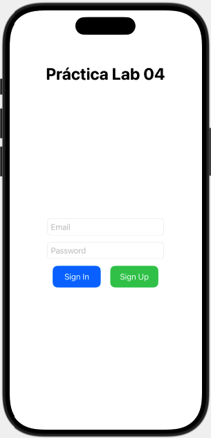
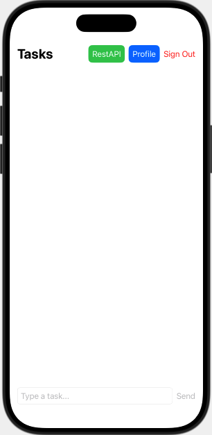

### Laboratorio Calificado 4 : RestAPI, Firebase : Auth and Firestore

### Implementar

  
  

#### 1.- Realizar el login con Firebase ( email / password)
#### 2.- Crear y mostrar el profile del usuario logeado ( 3 campos)
#### 3.- Permitir ingresar Task y almacenarlos en Firestone
#### 4.- Mostrar 3 campos de la invocación del Rest API : https://jsonplaceholder.typicode.com/users
